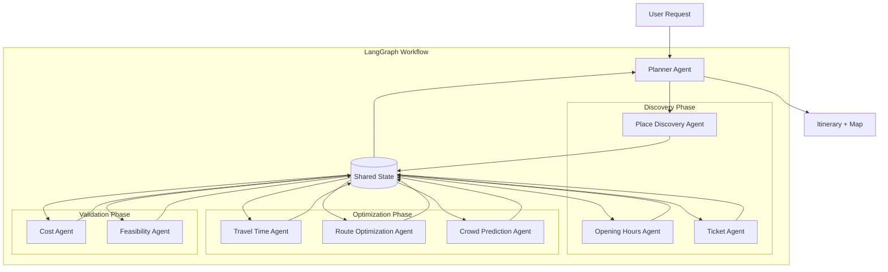

# Design Document: Agentic Travel Planner

## Overview

The Agentic Travel Planner uses a multi-agent architecture built on LangGraph to transform user requests into optimized, feasible travel itineraries. The system orchestrates specialized agents that each handle specific aspects of travel planning (place discovery, timing, costs, routing) and coordinates them through a central Planner Agent.

### Key Design Decisions

1. **LangGraph for Orchestration**: Provides stateful agent workflows with built-in error handling and retry logic
2. **Shared State Pattern**: All agents read from and write to a common state object, enabling coordination
3. **Tool-Based Agents**: Each agent has access to specific tools (functions) to gather information
4. **Iterative Planning**: The Planner generates draft itineraries, validates constraints, and refines until feasible
5. **Graceful Degradation**: Agent failures don't crash the system; partial results are returned with explanations
6. **Structured Output**: Agents return Pydantic models for type safety and validation

### Architecture Philosophy

The design follows a **coordinator-worker pattern** where:
- The Planner Agent acts as coordinator, orchestrating specialist agents
- Specialist agents are workers that perform specific tasks and return structured results
- State flows through the graph, accumulating information at each step
- The system can iterate multiple times to resolve conflicts and optimize

## Architecture

### System Architecture



### LangGraph Workflow

```python
from langgraph.graph import StateGraph, END

# Define the workflow
workflow = StateGraph(PlannerState)

# Add nodes (agents)
workflow.add_node("place_discovery", place_discovery_agent)
workflow.add_node("opening_hours", opening_hours_agent)
workflow.add_node("tickets", ticket_agent)
workflow.add_node("travel_time", travel_time_agent)
workflow.add_node("route_optimization", route_optimization_agent)
workflow.add_node("crowd_prediction", crowd_prediction_agent)
workflow.add_node("cost_calculation", cost_agent)
workflow.add_node("feasibility_check", feasibility_agent)
workflow.add_node("planner", planner_agent)

# Define edges (flow)
workflow.set_entry_point("place_discovery")
workflow.add_edge("place_discovery", "opening_hours")
workflow.add_edge("opening_hours", "tickets")
workflow.add_edge("tickets", "travel_time")
workflow.add_edge("travel_time", "route_optimization")
workflow.add_edge("route_optimization", "crowd_prediction")
workflow.add_edge("crowd_prediction", "cost_calculation")
workflow.add_edge("cost_calculation", "feasibility_check")

# Conditional edge: iterate or finish
workflow.add_conditional_edges(
    "feasibility_check",
    should_continue,
    {
        "continue": "planner",  # Refine and iterate
        "end": END              # Done
    }
)
workflow.add_edge("planner", "route_optimization")  # Re-optimize after changes

# Compile
app = workflow.compile()
```

## Components and Interfaces

### 1. Shared State

**Responsibility**: Store all information accumulated during planning

**Schema**:
```python
from typing import List, Optional, Dict, Any
from pydantic import BaseModel
from datetime import datetime, time

class PlannerState(BaseModel):
    # User input
    user_query: str
    user_preferences: UserPreferences
    
    # Discovered places
    candidate_places: List[Place]
    selected_places: List[Place]
    
    # Constraints
    opening_hours: Dict[str, OpeningHours]
    ticket_info: Dict[str, TicketInfo]
    travel_times: Dict[tuple, TravelTime]
    
    # Optimization
    optimized_route: Optional[List[str]]
    crowd_predictions: Dict[str, CrowdLevel]
    
    # Validation
    total_cost: Optional[float]
    feasibility_score: Optional[float]
    feasibility_issues: List[str]
    
    # Iteration control
    iteration_count: int = 0
    max_iterations: int = 3
    is_feasible: bool = False
    
    # Final output
    itinerary: Optional[Itinerary]
    explanation: str = ""
```

### 2. Place Discovery Agent

**Responsibility**: Find relevant places based on user query and preferences

**Tools**:
- `search_places(query: str, preferences: UserPreferences) -> List[Place]`
- `classify_place_type(place_name: str) -> PlaceType`
- `estimate_visit_duration(place_name: str, place_type: PlaceType) -> int`

**Input**: `user_query`, `user_preferences`

**Output**: Updates `candidate_places` in state

**Implementation**:
```python
def place_discovery_agent(state: PlannerState) -> PlannerState:
    """Discover places using RAG and classify them."""
    
    # Use existing RAG system
    rag_results = rag_chain.invoke(state.user_query)
    
    # Extract places from response
    place_mentions = place_extractor.extract_places(rag_results)
    
    # Enrich with metadata
    places = []
    for mention in place_mentions:
        place = Place(
            name=mention.name,
            place_type=classify_place_type(mention.name),
            visit_duration=estimate_visit_duration(mention.name),
            coordinates=geocoder.geocode_place(mention.name),
            description=extract_description(rag_results, mention.name)
        )
        places.append(place)
    
    # Rank by relevance to preferences
    ranked_places = rank_by_preferences(places, state.user_preferences)
    
    state.candidate_places = ranked_places[:10]  # Top 10
    return state
```

### 3. Opening Hours Agent

**Responsibility**: Check opening hours and validate timing

**Tools**:
- `get_opening_hours(place_name: str, date: datetime) -> OpeningHours`
- `check_is_open(place_name: str, time: datetime) -> bool`
- `get_last_entry_time(place_name: str) -> time`

**Data Source**: `data/opening_hours.json` (manually curated)

**Input**: `candidate_places`

**Output**: Updates `opening_hours` in state

**Implementation**:
```python
def opening_hours_agent(state: PlannerState) -> PlannerState:
    """Check opening hours for all candidate places."""
    
    opening_hours = {}
    
    for place in state.candidate_places:
        hours = get_opening_hours(place.name, datetime.now())
        opening_hours[place.name] = hours
        
        # Flag if closed today
        if not hours.is_open_today:
            state.feasibility_issues.append(
                f"{place.name} is closed today"
            )
    
    state.opening_hours = opening_hours
    return state
```

### 4. Ticket Agent

**Responsibility**: Check ticket requirements and pricing

**Tools**:
- `get_ticket_info(place_name: str) -> TicketInfo`
- `check_reservation_required(place_name: str) -> bool`
- `get_ticket_price(place_name: str) -> float`

**Data Source**: `data/ticket_info.json` (manually curated)

**Input**: `candidate_places`

**Output**: Updates `ticket_info` in state

**Implementation**:
```python
def ticket_agent(state: PlannerState) -> PlannerState:
    """Check ticket requirements for all places."""
    
    ticket_info = {}
    
    for place in state.candidate_places:
        info = get_ticket_info(place.name)
        ticket_info[place.name] = info
        
        # Flag if reservation required
        if info.reservation_required:
            state.explanation += f"\n⚠️ {place.name} requires advance booking"
    
    state.ticket_info = ticket_info
    return state
```

### 5. Travel Time Agent

**Responsibility**: Calculate travel times between all place pairs

**Tools**:
- `calculate_travel_time(start: Place, end: Place, mode: str) -> TravelTime`
- `suggest_transport_mode(distance: float) -> str`

**Input**: `candidate_places`

**Output**: Updates `travel_times` in state

**Implementation**:
```python
def travel_time_agent(state: PlannerState) -> PlannerState:
    """Calculate travel times between all place pairs."""
    
    places = state.candidate_places
    travel_times = {}
    
    for i, place_a in enumerate(places):
        for place_b in places[i+1:]:
            # Use existing router
            result = router.get_route(
                place_a.coordinates,
                place_b.coordinates,
                mode="pedestrian"
            )
            
            if result:
                route_coords, duration = result
                travel_times[(place_a.name, place_b.name)] = TravelTime(
                    duration_minutes=duration / 60,
                    distance_km=calculate_distance(route_coords),
                    mode="pedestrian"
                )
    
    state.travel_times = travel_times
    return state
```

### 6. Route Optimization Agent

**Responsibility**: Optimize the order of places to minimize travel time

**Tools**:
- `optimize_route(places: List[Place], constraints: Dict) -> List[str]`
- `solve_tsp(distance_matrix: np.ndarray) -> List[int]`

**Algorithm**: Constrained TSP with time windows

**Input**: `selected_places`, `travel_times`, `opening_hours`, `ticket_info`

**Output**: Updates `optimized_route` in state

**Implementation**:
```python
from scipy.optimize import linear_sum_assignment
import numpy as np

def route_optimization_agent(state: PlannerState) -> PlannerState:
    """Optimize route order with constraints."""
    
    places = state.selected_places or state.candidate_places[:5]
    
    # Build distance matrix
    n = len(places)
    dist_matrix = np.zeros((n, n))
    
    for i, place_a in enumerate(places):
        for j, place_b in enumerate(places):
            if i != j:
                key = (place_a.name, place_b.name)
                travel_time = state.travel_times.get(key)
                if travel_time:
                    dist_matrix[i][j] = travel_time.duration_minutes
    
    # Solve TSP (simplified - use OR-Tools for real implementation)
    route_indices = solve_tsp_with_constraints(
        dist_matrix,
        opening_hours=state.opening_hours,
        ticket_times=state.ticket_info
    )
    
    # Convert to place names
    optimized_route = [places[i].name for i in route_indices]
    
    state.optimized_route = optimized_route
    return state
```

### 7. Crowd Prediction Agent

**Responsibility**: Predict crowd levels and suggest best times

**Tools**:
- `predict_crowd_level(place: str, time: datetime) -> CrowdLevel`
- `get_best_visiting_time(place: str, date: datetime) -> time`

**Data Source**: Heuristics + historical patterns

**Input**: `optimized_route`

**Output**: Updates `crowd_predictions` in state

**Implementation**:
```python
def crowd_prediction_agent(state: PlannerState) -> PlannerState:
    """Predict crowd levels for each place."""
    
    crowd_predictions = {}
    
    for place_name in state.optimized_route:
        # Simple heuristics (can be enhanced with ML)
        hour = datetime.now().hour
        day_of_week = datetime.now().weekday()
        
        crowd_level = predict_crowd_level(place_name, hour, day_of_week)
        crowd_predictions[place_name] = crowd_level
        
        if crowd_level == CrowdLevel.VERY_HIGH:
            state.explanation += f"\n⚠️ {place_name} will be very crowded"
    
    state.crowd_predictions = crowd_predictions
    return state
```

### 8. Cost Agent

**Responsibility**: Calculate total itinerary cost

**Tools**:
- `calculate_total_cost(itinerary: List[Place], ticket_info: Dict) -> float`
- `estimate_meal_cost(num_meals: int) -> float`
- `estimate_transport_cost(travel_times: Dict) -> float`

**Input**: `optimized_route`, `ticket_info`, `travel_times`

**Output**: Updates `total_cost` in state

**Implementation**:
```python
def cost_agent(state: PlannerState) -> PlannerState:
    """Calculate total cost of itinerary."""
    
    total_cost = 0.0
    breakdown = {}
    
    # Ticket costs
    ticket_cost = sum(
        state.ticket_info[place].price
        for place in state.optimized_route
        if place in state.ticket_info
    )
    breakdown["tickets"] = ticket_cost
    total_cost += ticket_cost
    
    # Meal costs (estimate)
    num_meals = estimate_num_meals(state.optimized_route)
    meal_cost = num_meals * 15.0  # €15 per meal average
    breakdown["meals"] = meal_cost
    total_cost += meal_cost
    
    # Transport costs (if using metro/bus)
    transport_cost = estimate_transport_cost(state.travel_times)
    breakdown["transport"] = transport_cost
    total_cost += transport_cost
    
    state.total_cost = total_cost
    state.explanation += f"\n💰 Total estimated cost: €{total_cost:.2f}"
    
    return state
```

### 9. Feasibility Agent

**Responsibility**: Validate itinerary feasibility

**Tools**:
- `check_time_feasibility(itinerary: Itinerary) -> bool`
- `check_distance_feasibility(total_distance: float) -> bool`
- `calculate_feasibility_score(state: PlannerState) -> float`

**Input**: All state data

**Output**: Updates `feasibility_score`, `is_feasible`, `feasibility_issues`

**Implementation**:
```python
def feasibility_agent(state: PlannerState) -> PlannerState:
    """Check if itinerary is feasible."""
    
    issues = []
    score = 100.0
    
    # Check total walking distance
    total_distance = calculate_total_distance(
        state.optimized_route,
        state.travel_times
    )
    
    if total_distance > state.user_preferences.max_walking_km:
        issues.append(f"Walking distance ({total_distance:.1f}km) exceeds limit")
        score -= 30
    
    # Check total time
    total_time = calculate_total_time(
        state.optimized_route,
        state.candidate_places,
        state.travel_times
    )
    
    if total_time > state.user_preferences.available_hours * 60:
        issues.append(f"Total time ({total_time/60:.1f}h) exceeds available time")
        score -= 40
    
    # Check opening hours conflicts
    for place in state.optimized_route:
        if place in state.opening_hours:
            if not state.opening_hours[place].is_open_today:
                issues.append(f"{place} is closed today")
                score -= 20
    
    # Check budget
    if state.total_cost > state.user_preferences.max_budget:
        issues.append(f"Cost (€{state.total_cost:.0f}) exceeds budget")
        score -= 20
    
    state.feasibility_score = max(0, score)
    state.feasibility_issues = issues
    state.is_feasible = score >= 70  # Threshold
    
    return state
```

### 10. Planner Agent (Orchestrator)

**Responsibility**: Coordinate agents and refine itinerary

**Input**: All state data

**Output**: Final `itinerary` or instructions to iterate

**Implementation**:
```python
def planner_agent(state: PlannerState) -> PlannerState:
    """Orchestrate planning and handle iterations."""
    
    # Check if we should iterate
    if not state.is_feasible and state.iteration_count < state.max_iterations:
        # Try to fix issues
        if "Walking distance" in str(state.feasibility_issues):
            # Reduce number of places
            state.selected_places = state.candidate_places[:3]
            state.explanation += "\n🔄 Reducing stops to meet distance constraint"
        
        if "Total time" in str(state.feasibility_issues):
            # Remove longest visits
            state.selected_places = remove_longest_visits(state.selected_places)
            state.explanation += "\n🔄 Removing time-consuming stops"
        
        state.iteration_count += 1
        return state  # Will re-optimize
    
    # Generate final itinerary
    itinerary = build_itinerary(
        route=state.optimized_route,
        places=state.candidate_places,
        travel_times=state.travel_times,
        opening_hours=state.opening_hours,
        ticket_info=state.ticket_info,
        crowd_predictions=state.crowd_predictions
    )
    
    state.itinerary = itinerary
    state.is_feasible = True
    
    return state
```

## Data Models

### Place
```python
from pydantic import BaseModel
from typing import Tuple, Optional

class Place(BaseModel):
    name: str
    place_type: str  # monument, restaurant, museum, etc.
    coordinates: Tuple[float, float]
    visit_duration: int  # minutes
    description: Optional[str] = None
    rating: Optional[float] = None
```

### OpeningHours
```python
from datetime import time

class OpeningHours(BaseModel):
    place_name: str
    is_open_today: bool
    opening_time: Optional[time]
    closing_time: Optional[time]
    last_entry_time: Optional[time]
    closed_days: List[str]
```

### TicketInfo
```python
class TicketInfo(BaseModel):
    place_name: str
    ticket_required: bool
    reservation_required: bool
    price: float  # EUR
    skip_the_line_available: bool
    booking_url: Optional[str]
```

### TravelTime
```python
class TravelTime(BaseModel):
    duration_minutes: float
    distance_km: float
    mode: str  # pedestrian, metro, bus
```

### CrowdLevel
```python
from enum import Enum

class CrowdLevel(Enum):
    LOW = "low"
    MEDIUM = "medium"
    HIGH = "high"
    VERY_HIGH = "very_high"
```

### Itinerary
```python
from datetime import datetime

class ItineraryStop(BaseModel):
    time: datetime
    place: Place
    duration_minutes: int
    notes: List[str]
    ticket_info: Optional[TicketInfo]
    crowd_level: Optional[CrowdLevel]

class Itinerary(BaseModel):
    stops: List[ItineraryStop]
    total_duration_minutes: int
    total_distance_km: float
    total_cost: float
    feasibility_score: float
    explanation: str
```

### UserPreferences
```python
class UserPreferences(BaseModel):
    interests: List[str]  # art, food, history, photography
    available_hours: float  # hours available
    max_budget: float  # EUR
    max_walking_km: float  # max walking distance
    crowd_tolerance: str  # avoid, neutral, dont_care
    start_time: Optional[time] = None
```

## Error Handling

### Agent Failure Strategy

```python
def safe_agent_execution(agent_func, state, agent_name):
    """Wrap agent execution with error handling."""
    try:
        return agent_func(state)
    except Exception as e:
        logger.error(f"{agent_name} failed: {e}")
        state.explanation += f"\n⚠️ {agent_name} encountered an issue, using defaults"
        return state  # Return state unchanged
```

### Timeout Handling

```python
from functools import wraps
import signal

def timeout(seconds):
    def decorator(func):
        @wraps(func)
        def wrapper(*args, **kwargs):
            def handler(signum, frame):
                raise TimeoutError()
            
            signal.signal(signal.SIGALRM, handler)
            signal.alarm(seconds)
            try:
                result = func(*args, **kwargs)
            finally:
                signal.alarm(0)
            return result
        return wrapper
    return decorator

@timeout(10)
def get_opening_hours(place_name: str):
    # Tool implementation
    pass
```

## Testing Strategy

### Unit Tests
- Test each agent independently with mock state
- Test each tool function
- Test state transitions

### Integration Tests
- Test full workflow with sample queries
- Test iteration logic
- Test constraint handling

### Property Tests
- Test that feasibility score is always 0-100
- Test that itinerary times are chronological
- Test that total cost matches sum of components

## Deployment Considerations

### Performance Optimization
1. Cache opening hours and ticket info
2. Parallelize independent agent calls
3. Use async for API calls
4. Limit RAG retrieval to top-k results

### Monitoring
1. Log agent execution times
2. Track feasibility scores
3. Monitor iteration counts
4. Alert on frequent failures

### Scalability
1. Use Redis for state caching
2. Queue long-running planning requests
3. Implement rate limiting for external APIs
