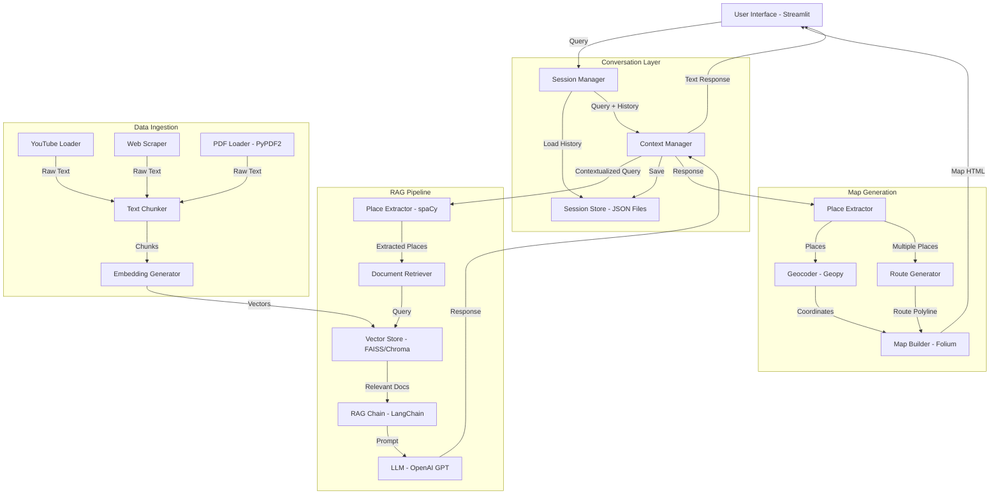

# Design Document: Rome Places Chatbot

## Overview

The Rome Places Chatbot is a conversational AI system that provides information about places in Rome through a dual-output interface: natural language responses and interactive map visualizations. The system uses Retrieval-Augmented Generation (RAG) to ground responses in curated content from YouTube and web sources, while maintaining conversation context across sessions.

### Key Design Decisions

1. **RAG Architecture**: Using LangChain with OpenAI embeddings and GPT models to ensure factual, grounded responses based on curated content rather than pure generative responses
2. **Dual Output System**: Separating text generation (RAG pipeline) from map generation (place extraction + geocoding + Folium) to allow independent optimization of each component
3. **Session Persistence**: File-based JSON storage for conversation histories, providing simplicity and portability without requiring database infrastructure
4. **Place Extraction Pipeline**: Using spaCy NER combined with custom pattern matching to identify place mentions in both user queries and chatbot responses
5. **Streamlit Framework**: Leveraging Streamlit's session state for in-memory conversation management and st-folium for seamless map integration

### Architecture Philosophy

The design follows a pipeline architecture where each stage has clear inputs and outputs:
- User input → Place extraction → Context retrieval → Response generation → Place extraction → Map generation → Display
- Session management operates orthogonally, persisting state at each interaction point

## Architecture

### System Architecture



### Component Interaction Flow

1. **User Query Processing**:
   - User submits query through Streamlit interface
   - Session Manager loads conversation history from Session Store
   - Context Manager combines current query with relevant history

2. **RAG Response Generation**:
   - Place Extractor identifies place mentions in query using spaCy NER
   - Document Retriever queries Vector Store for relevant content chunks
   - RAG Chain constructs prompt with retrieved context + conversation history
   - LLM generates grounded response
   - Response is saved to Session Store

3. **Map Visualization**:
   - Place Extractor identifies places mentioned in the response
   - Geocoder converts place names to coordinates using Geopy
   - Route Generator creates connecting paths if multiple places exist
   - Map Builder generates Folium map with markers and routes
   - st-folium renders interactive map in Streamlit

4. **Data Ingestion** (offline process):
   - Content loaders extract text from YouTube, websites, and PDFs
   - Text Chunker splits content into semantic chunks
   - Embedding Generator creates vector representations
   - Vectors stored in Vector Store for retrieval

## Components and Interfaces

### 1. Session Manager

**Responsibility**: Manage user sessions and conversation persistence

**Interface**:
```python
class SessionManager:
    def get_or_create_session(user_id: str) -> Session
    def load_conversation_history(session_id: str) -> List[Message]
    def save_message(session_id: str, message: Message) -> None
    def clear_history(session_id: str) -> None
    def export_history(session_id: str) -> str
    def list_sessions(user_id: str) -> List[SessionMetadata]
```

**Implementation Notes**:
- Uses file-based storage with one JSON file per session
- Session files named: `{user_id}_{session_id}.json`
- Implements 90-day retention policy through background cleanup task
- Handles concurrent access through file locking

### 2. Context Manager

**Responsibility**: Manage conversation context and history integration

**Interface**:
```python
class ContextManager:
    def build_context(query: str, history: List[Message], max_tokens: int) -> str
    def add_to_history(session_id: str, role: str, content: str) -> None
    def get_relevant_history(query: str, history: List[Message], k: int) -> List[Message]
```

**Implementation Notes**:
- Implements sliding window for token management (max 4000 tokens for context)
- Uses semantic similarity to select most relevant historical messages
- Formats history in ChatML format for OpenAI API

### 3. Place Extractor

**Responsibility**: Extract place names from text using NLP

**Interface**:
```python
class PlaceExtractor:
    def extract_places(text: str) -> List[PlaceMention]
    def filter_rome_places(places: List[PlaceMention]) -> List[PlaceMention]
    def resolve_ambiguous_places(places: List[PlaceMention], context: str) -> List[PlaceMention]
```

**Implementation Notes**:
- Uses spaCy's `en_core_web_sm` model for NER (GPE, LOC, FAC entities)
- Custom pattern matching for common Rome landmarks (e.g., "Colosseum", "Trevi Fountain")
- Maintains gazetteer of known Rome places for validation
- Returns confidence scores for each extraction

### 4. RAG Chain

**Responsibility**: Orchestrate retrieval and generation pipeline

**Interface**:
```python
class RAGChain:
    def __init__(llm: BaseLLM, retriever: BaseRetriever)
    def invoke(query: str, context: str) -> str
    def stream(query: str, context: str) -> Iterator[str]
```

**Implementation Notes**:
- Built using LangChain's `RetrievalQA` chain
- Retrieves top-k=5 most relevant document chunks
- Uses custom prompt template that emphasizes Rome-specific information
- Implements streaming for real-time response display

### 5. Vector Store

**Responsibility**: Store and retrieve document embeddings

**Interface**:
```python
class VectorStore:
    def add_documents(documents: List[Document]) -> None
    def similarity_search(query: str, k: int) -> List[Document]
    def similarity_search_with_score(query: str, k: int) -> List[Tuple[Document, float]]
    def delete_documents(ids: List[str]) -> None
```

**Implementation Notes**:
- Uses FAISS for local vector storage (alternative: Chroma for persistence)
- OpenAI `text-embedding-ada-002` for embeddings (1536 dimensions)
- Stores metadata: source URL, timestamp, place tags
- Implements incremental updates for new content

### 6. Geocoder

**Responsibility**: Convert place names to geographic coordinates

**Interface**:
```python
class Geocoder:
    def geocode_place(place_name: str, bias_location: Tuple[float, float]) -> Optional[Coordinates]
    def batch_geocode(places: List[str]) -> Dict[str, Optional[Coordinates]]
    def reverse_geocode(lat: float, lon: float) -> Optional[str]
```

**Implementation Notes**:
- Uses Geopy with Nominatim geocoder (OpenStreetMap)
- Biases searches to Rome bounding box: (41.8, 12.4) to (41.95, 12.6)
- Implements caching to avoid redundant API calls
- Fallback to manual coordinate database for major landmarks

### 7. Map Builder

**Responsibility**: Generate interactive maps with Folium

**Interface**:
```python
class MapBuilder:
    def create_base_map(center: Tuple[float, float], zoom: int) -> folium.Map
    def add_markers(map_obj: folium.Map, places: List[PlaceMarker]) -> None
    def add_route(map_obj: folium.Map, coordinates: List[Tuple[float, float]]) -> None
    def render_to_streamlit(map_obj: folium.Map) -> None
```

**Implementation Notes**:
- Default center: Rome city center (41.9028, 12.4964)
- Custom marker icons for different place types (landmark, restaurant, etc.)
- Route visualization using PolyLine with color coding
- Popup content includes place name and brief description

### 8. Data Loaders

**Responsibility**: Ingest content from various sources

**Interface**:
```python
class YouTubeLoader:
    def load_transcript(video_url: str) -> Document

class WebLoader:
    def load_webpage(url: str) -> Document

class PDFLoader:
    def load_pdf(file_path: str) -> List[Document]
```

**Implementation Notes**:
- YouTube: Uses youtube-transcript-api for subtitle extraction
- Web: BeautifulSoup for HTML parsing, focuses on main content
- PDF: PyPDF2 for text extraction
- All loaders return LangChain Document objects with metadata

## Data Models

### Message

```python
@dataclass
class Message:
    role: str  # "user" or "assistant"
    content: str
    timestamp: datetime
    session_id: str
    metadata: Dict[str, Any]  # Optional: extracted_places, sources, etc.
```

### Session

```python
@dataclass
class Session:
    session_id: str
    user_id: str
    created_at: datetime
    last_interaction: datetime
    message_count: int
```

### PlaceMention

```python
@dataclass
class PlaceMention:
    name: str
    entity_type: str  # GPE, LOC, FAC
    confidence: float
    span: Tuple[int, int]  # Character positions in text
    context: str  # Surrounding text
```

### PlaceMarker

```python
@dataclass
class PlaceMarker:
    name: str
    coordinates: Tuple[float, float]  # (latitude, longitude)
    place_type: str  # landmark, restaurant, attraction, etc.
    description: Optional[str]
    icon: str  # Icon identifier for map marker
```

### Document

```python
@dataclass
class Document:
    page_content: str
    metadata: Dict[str, Any]  # source, url, timestamp, places, chunk_id
```

### Coordinates

```python
@dataclass
class Coordinates:
    latitude: float
    longitude: float
    accuracy: str  # "exact", "approximate", "fallback"
    source: str  # "geocoder", "manual", "cache"
```

### SessionStore Schema (JSON)

```json
{
  "session_id": "uuid-string",
  "user_id": "user-identifier",
  "created_at": "ISO-8601-timestamp",
  "last_interaction": "ISO-8601-timestamp",
  "messages": [
    {
      "role": "user|assistant",
      "content": "message text",
      "timestamp": "ISO-8601-timestamp",
      "metadata": {
        "extracted_places": ["place1", "place2"],
        "sources": ["url1", "url2"]
      }
    }
  ]
}
```


## Correctness Properties

*A property is a characteristic or behavior that should hold true across all valid executions of a system—essentially, a formal statement about what the system should do. Properties serve as the bridge between human-readable specifications and machine-verifiable correctness guarantees.*

### Property 1: Message Persistence Round-Trip

*For any* message (user or assistant) with content, timestamp, and session identifier, persisting the message to the Session Store and then retrieving the conversation history should return a message with identical content, timestamp, and session identifier.

**Validates: Requirements 1.1, 1.2, 1.3**

### Property 2: Chronological Message Ordering

*For any* set of messages with different timestamps in a conversation history, retrieving the conversation history should return messages sorted in chronological order (earliest to latest).

**Validates: Requirements 1.5**

### Property 3: Context Includes History

*For any* response generation request with non-empty conversation history, the context passed to the RAG chain should include at least one message from the conversation history.

**Validates: Requirements 2.1**

### Property 4: Cross-Session Continuity

*For any* user with multiple sessions, retrieving all conversation histories for that user should return messages from all sessions associated with that user identifier.

**Validates: Requirements 2.3**

### Property 5: Place Reference Resolution

*For any* place mentioned in conversation history, when a user references that place in a subsequent query (using pronouns or partial names), the place extractor combined with conversation context should identify the same place.

**Validates: Requirements 2.2**

### Property 6: Place Query Retrieval

*For any* place name query, the RAG pipeline should retrieve at least one document from the vector store that contains information about that place (assuming the place exists in the knowledge base).

**Validates: Requirements 3.1**

### Property 7: Place Type Coverage

*For any* place type (landmark, restaurant, attraction, point of interest), the vector store should contain documents tagged with that place type, and queries for that type should retrieve relevant documents.

**Validates: Requirements 3.2**

### Property 8: Recommendation Generation

*For any* recommendation request query, the chatbot response should contain at least one place suggestion with a place name that can be extracted by the place extractor.

**Validates: Requirements 3.3**

### Property 9: History Deletion Round-Trip

*For any* session with stored messages, clearing the history and then retrieving the conversation history should return an empty list of messages.

**Validates: Requirements 5.1**

### Property 10: Unique Session Identifiers

*For any* two consecutive new conversation starts, the generated session identifiers should be different (unique).

**Validates: Requirements 5.2**

### Property 11: Session Listing Completeness

*For any* user with N sessions stored in the Session Store, listing sessions for that user should return exactly N session metadata objects.

**Validates: Requirements 5.3**

### Property 12: History Export Round-Trip

*For any* conversation history, exporting the history to a readable format and then parsing that format should preserve all message content, roles, and timestamps.

**Validates: Requirements 5.4**

### Property 13: Place Extraction Consistency

*For any* text containing place names, running the place extractor multiple times on the same text should return the same set of place mentions (deterministic extraction).

**Validates: Implementation correctness for place extraction pipeline**

### Property 14: Geocoding Cache Consistency

*For any* place name that has been successfully geocoded, subsequent geocoding requests for the same place name should return the same coordinates (from cache).

**Validates: Implementation correctness for geocoding with caching**

### Property 15: Map Marker Correspondence

*For any* list of place mentions with valid coordinates, the generated Folium map should contain exactly one marker for each unique place.

**Validates: Implementation correctness for map generation**

## Error Handling

### Error Categories

1. **Storage Errors**
   - Session Store unavailable or inaccessible
   - File system permission errors
   - Corrupted session data

2. **API Errors**
   - OpenAI API rate limits or failures
   - Geocoding service unavailable
   - Network timeouts

3. **Data Errors**
   - Invalid user input (empty messages, malformed queries)
   - Place names not found in knowledge base
   - Geocoding failures for place names

4. **System Errors**
   - Out of memory during vector search
   - Model loading failures
   - Configuration errors

### Error Handling Strategies

#### Storage Errors

**Strategy**: Graceful degradation with logging

```python
try:
    history = session_store.load_conversation_history(session_id)
except StorageUnavailableError as e:
    logger.error(f"Session store unavailable: {e}")
    history = []  # Continue with empty context
    display_warning("Unable to load conversation history. Starting fresh.")
except CorruptedDataError as e:
    logger.error(f"Corrupted session data: {e}")
    history = []
    display_warning("Previous conversation data corrupted. Starting new session.")
```

**Rationale**: The chatbot should remain functional even if persistence fails. Users can still get answers, just without historical context.

#### API Errors

**Strategy**: Retry with exponential backoff, then fallback

```python
@retry(max_attempts=3, backoff_factor=2)
def call_openai_api(prompt: str) -> str:
    try:
        return openai.ChatCompletion.create(...)
    except RateLimitError:
        raise  # Retry
    except APIError as e:
        logger.error(f"OpenAI API error: {e}")
        return "I'm having trouble connecting to my knowledge base. Please try again in a moment."
```

**Rationale**: Transient API failures are common. Retries handle temporary issues, while fallback messages maintain user experience.

#### Geocoding Errors

**Strategy**: Fallback to manual coordinate database

```python
def geocode_with_fallback(place_name: str) -> Optional[Coordinates]:
    try:
        coords = geocoder.geocode_place(place_name, bias_location=ROME_CENTER)
        if coords:
            return coords
    except GeocodingError as e:
        logger.warning(f"Geocoding failed for {place_name}: {e}")
    
    # Fallback to manual database
    return MANUAL_COORDINATES.get(place_name.lower())
```

**Rationale**: Major Rome landmarks should always be mappable. Manual fallback ensures reliability for common places.

#### Place Extraction Errors

**Strategy**: Return empty list, log for improvement

```python
def extract_places_safe(text: str) -> List[PlaceMention]:
    try:
        return place_extractor.extract_places(text)
    except Exception as e:
        logger.error(f"Place extraction failed: {e}", exc_info=True)
        return []  # No places extracted, but don't crash
```

**Rationale**: Place extraction is optional enhancement. If it fails, text response is still valuable.

#### Vector Store Errors

**Strategy**: Return empty results with user notification

```python
def retrieve_documents_safe(query: str, k: int) -> List[Document]:
    try:
        return vector_store.similarity_search(query, k)
    except VectorStoreError as e:
        logger.error(f"Vector store error: {e}")
        display_warning("Knowledge base temporarily unavailable. Responses may be limited.")
        return []
```

**Rationale**: Without retrieval, the system falls back to pure LLM generation. Less grounded but still functional.

### Error Logging

All errors should be logged with:
- Timestamp
- Error type and message
- Stack trace (for exceptions)
- User session ID (for debugging)
- Request context (query, session state)

Log levels:
- **ERROR**: System failures requiring attention (API failures, storage errors)
- **WARNING**: Degraded functionality (geocoding failures, missing data)
- **INFO**: Normal operations (session creation, successful queries)
- **DEBUG**: Detailed execution flow (place extraction results, retrieval scores)

### User-Facing Error Messages

Error messages should be:
1. **Non-technical**: Avoid jargon and implementation details
2. **Actionable**: Suggest what the user can do
3. **Reassuring**: Maintain confidence in the system

Examples:
- ❌ "VectorStoreConnectionError: FAISS index not found"
- ✅ "I'm having trouble accessing my knowledge base. Please try again in a moment."

- ❌ "GeocodingAPIRateLimitExceeded"
- ✅ "I can't show that location on the map right now, but I can still tell you about it."

## Testing Strategy

### Dual Testing Approach

The Rome Places Chatbot requires both unit testing and property-based testing to ensure correctness:

- **Unit tests**: Verify specific examples, edge cases, and error conditions
- **Property tests**: Verify universal properties across all inputs

Both approaches are complementary and necessary for comprehensive coverage. Unit tests catch concrete bugs in specific scenarios, while property tests verify general correctness across a wide range of inputs.

### Unit Testing

Unit tests should focus on:

1. **Specific Examples**
   - Test that "Colosseum" query retrieves relevant documents
   - Test that greeting "Hello" receives appropriate greeting response
   - Test that session creation generates valid UUID

2. **Edge Cases**
   - Empty message handling
   - Very long conversation histories (>100 messages)
   - Place names with special characters
   - Queries in languages other than English

3. **Error Conditions**
   - Storage unavailable scenarios
   - API timeout handling
   - Invalid session IDs
   - Corrupted JSON data

4. **Integration Points**
   - Streamlit session state management
   - st-folium map rendering
   - OpenAI API integration
   - File system operations

**Example Unit Tests**:

```python
def test_session_creation_generates_uuid():
    session = session_manager.get_or_create_session("user123")
    assert is_valid_uuid(session.session_id)

def test_empty_message_rejected():
    with pytest.raises(ValueError):
        session_manager.save_message("session1", Message(role="user", content=""))

def test_storage_unavailable_returns_empty_history(monkeypatch):
    monkeypatch.setattr("os.path.exists", lambda x: False)
    history = session_manager.load_conversation_history("session1")
    assert history == []

def test_colosseum_query_retrieves_documents():
    docs = vector_store.similarity_search("Tell me about the Colosseum", k=5)
    assert len(docs) > 0
    assert any("colosseum" in doc.page_content.lower() for doc in docs)
```

### Property-Based Testing

Property-based testing will use **Hypothesis** (Python's leading property-based testing library) to verify universal properties across randomly generated inputs.

**Configuration**:
- Minimum 100 iterations per property test
- Each test tagged with reference to design document property
- Tag format: `# Feature: rome-places-chatbot, Property {number}: {property_text}`

**Property Test Examples**:

```python
from hypothesis import given, strategies as st

# Feature: rome-places-chatbot, Property 1: Message Persistence Round-Trip
@given(
    content=st.text(min_size=1, max_size=1000),
    role=st.sampled_from(["user", "assistant"]),
    session_id=st.uuids()
)
@settings(max_examples=100)
def test_message_persistence_roundtrip(content, role, session_id):
    """For any message, persisting and retrieving should return identical content."""
    timestamp = datetime.now()
    message = Message(role=role, content=content, timestamp=timestamp, session_id=str(session_id))
    
    session_manager.save_message(str(session_id), message)
    history = session_manager.load_conversation_history(str(session_id))
    
    assert len(history) > 0
    retrieved = history[-1]
    assert retrieved.content == content
    assert retrieved.role == role
    assert retrieved.session_id == str(session_id)

# Feature: rome-places-chatbot, Property 2: Chronological Message Ordering
@given(messages=st.lists(
    st.builds(Message,
        role=st.sampled_from(["user", "assistant"]),
        content=st.text(min_size=1),
        timestamp=st.datetimes(),
        session_id=st.just("test_session")
    ),
    min_size=2,
    max_size=20
))
@settings(max_examples=100)
def test_chronological_ordering(messages):
    """For any set of messages, retrieval should return them in chronological order."""
    session_id = "test_session_" + str(uuid.uuid4())
    
    for msg in messages:
        session_manager.save_message(session_id, msg)
    
    history = session_manager.load_conversation_history(session_id)
    timestamps = [msg.timestamp for msg in history]
    
    assert timestamps == sorted(timestamps)

# Feature: rome-places-chatbot, Property 9: History Deletion Round-Trip
@given(
    session_id=st.uuids(),
    messages=st.lists(
        st.builds(Message,
            role=st.sampled_from(["user", "assistant"]),
            content=st.text(min_size=1),
            timestamp=st.datetimes(),
            session_id=st.just("dummy")
        ),
        min_size=1,
        max_size=10
    )
)
@settings(max_examples=100)
def test_history_deletion_roundtrip(session_id, messages):
    """For any session with messages, clearing history should result in empty retrieval."""
    sid = str(session_id)
    
    for msg in messages:
        msg.session_id = sid
        session_manager.save_message(sid, msg)
    
    session_manager.clear_history(sid)
    history = session_manager.load_conversation_history(sid)
    
    assert history == []

# Feature: rome-places-chatbot, Property 10: Unique Session Identifiers
@given(user_id=st.text(min_size=1, max_size=50))
@settings(max_examples=100)
def test_unique_session_identifiers(user_id):
    """For any two consecutive session creations, IDs should be different."""
    session1 = session_manager.get_or_create_session(user_id)
    session2 = session_manager.get_or_create_session(user_id)
    
    assert session1.session_id != session2.session_id

# Feature: rome-places-chatbot, Property 13: Place Extraction Consistency
@given(text=st.text(min_size=10, max_size=500))
@settings(max_examples=100)
def test_place_extraction_deterministic(text):
    """For any text, place extraction should be deterministic."""
    places1 = place_extractor.extract_places(text)
    places2 = place_extractor.extract_places(text)
    
    assert len(places1) == len(places2)
    assert [p.name for p in places1] == [p.name for p in places2]

# Feature: rome-places-chatbot, Property 14: Geocoding Cache Consistency
@given(place_name=st.text(min_size=3, max_size=50))
@settings(max_examples=100)
def test_geocoding_cache_consistency(place_name):
    """For any place name, repeated geocoding should return same coordinates."""
    coords1 = geocoder.geocode_place(place_name, bias_location=ROME_CENTER)
    coords2 = geocoder.geocode_place(place_name, bias_location=ROME_CENTER)
    
    if coords1 is not None:
        assert coords2 is not None
        assert coords1.latitude == coords2.latitude
        assert coords1.longitude == coords2.longitude
```

### Test Coverage Goals

- **Unit test coverage**: >80% of code lines
- **Property test coverage**: All 15 correctness properties implemented
- **Integration test coverage**: All major user flows (query → response → map)
- **Error handling coverage**: All error categories tested

### Testing Tools

- **pytest**: Test runner and framework
- **Hypothesis**: Property-based testing library
- **pytest-mock**: Mocking for external dependencies
- **pytest-cov**: Coverage reporting
- **responses**: HTTP request mocking for API tests

### Continuous Testing

- Run unit tests on every commit
- Run property tests (100 iterations) on every pull request
- Run extended property tests (1000 iterations) nightly
- Monitor test execution time (target: <5 minutes for full suite)
